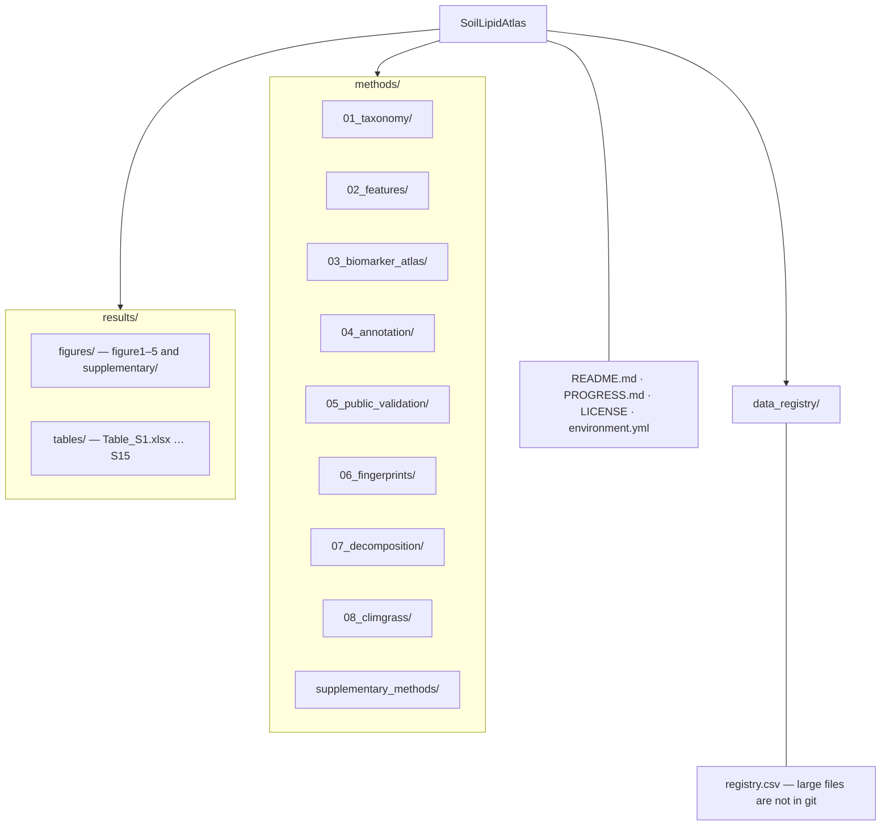

# SoilLipidAtlas

Code, methods documentation, and result assets for **SoilMass Paper 2** —
*Distributed lipid fingerprints encode phylum-level identity across the soil
food web*.

Soil organisms from across the food web — bacteria, archaea, fungi, plants,
animals, protists — were cultured, their lipidomes measured by untargeted
LC-MS/MS, and their phylum-level lipid signatures extracted, annotated, and
validated. The resulting reference atlas is then applied to real field soil
(the ClimGrass climate-change experiment) to decode community composition
from lipids alone.

**The study in numbers**

| | |
|---|---|
| Organisms cultured | 19 phyla collected → **16 phyla analysed** (≥2 samples in both ionisation modes) |
| Aligned features | 273,248 (positive mode) / 122,571 (negative mode) |
| Biomarker atlas | **11,371 POS / 5,697 NEG** phylum-enriched features |
| Annotation | 6,360 POS / 1,889 NEG annotated; SIRIUS formula coverage 70.4% POS |
| Public validation | 2,287 POS / 486 NEG biomarkers found in public soil datasets |
| Negative control | 79.3% correct dominant-group recovery over 164 pure isolates |
| Field application | 736 verified soil features; drought response replicates a published qSIP result |

Analysis release: `ncbi-phylum-2026-08-04-v1` (locked — any label change
requires a new release ID).

## Repository layout

What sits inside those folders:

- **`methods/01_…`–`08_…`** — each step is one folder: `README.md`, `scripts/`, and the small result tables for that step.
- **`results/figures/figureN/`** — rendered figure plus an `r/` bundle (R script, style file, plotted CSVs). Supplementary figures are under `results/figures/supplementary/`.
- **`results/tables/`** — workbooks S1–S15 and their producer scripts.
- **`data_registry/`** — checksums and download locations for files too large for git (MassIVE, GNPS2, Zenodo).

## How to follow the analysis

1. **`PROGRESS.md`** — one page: what each step does, its headline result,
   and whether the supporting files are in git or on Zenodo.
2. **`methods/01_…` through `methods/08_…`**, in order. Every step folder
   contains:
   - a `README.md` that explains what the step does, what it reads, what it
     produces, and every number it contributes to the paper;
   - the producer scripts;
   - the step's key result tables (small enough for git), so claims can be
     checked without downloading anything.
3. **`results/`** — each figure and table sits next to the script that
   builds it. All data figures are rendered in R (house style
   `soilmass_style.R`); each figure folder's `r/` bundle re-renders the
   figure from the included CSVs with R alone. Figure 1 is a workflow
   schematic in SVG, not a data plot. Supplementary Methods sections are
   indexed in `methods/supplementary_methods/`.
4. **`data_registry/registry.csv`** — files too large for git, with SHA-256
   checksums and their public home:
   - Raw LC-MS/MS data: **MassIVE MSV000102115**
   - Per-batch FBMN results: GNPS2 task IDs in
     `methods/02_features/fbmn_batches_{POS,NEG}.csv`
   - Derived large tables: Zenodo **10.5281/zenodo.20811187** (reserved)

## Reproducibility

- **Environment.** `environment.yml` pins the Python/R environment this
  release was built with.
- **What is in git.** Producer scripts and the small tables that support
  the paper's numbers. To re-run a producer, download its registry-listed
  inputs, verify the SHA-256, and point the path constants at the top of
  the script to those files. Run parameters and checksums are recorded in
  each step's `RUN_SUMMARY.json` or `*MANIFEST.json`.
- **Incomplete searches are not summarised.** SIRIUS and fastMASST runners
  refuse to write a summary until every expected input is present and
  checksummed.
- **Taxonomy labels.** Display labels follow the locked policy
  (Viridiplantae, Protists). A few producer-emitted CSVs still use the
  older keys Plantae and Protozoa; the README of the step that emits them
  notes this.

Scientific caveats (denominator choices, annotation scope, known biases)
are listed at the bottom of `PROGRESS.md` and in the relevant step README.

## License

This repository is released under the MIT License. See `LICENSE`.
